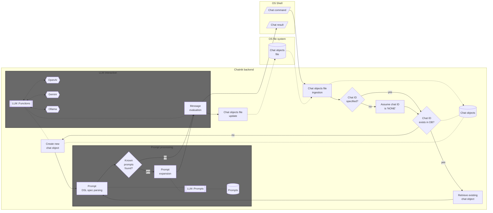
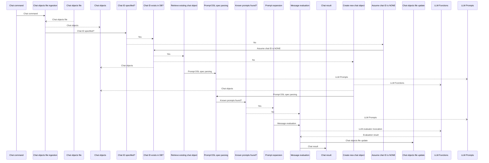

# Chatnik

Raku package that provides Command Line Interface (CLI) scripts for conversing with persistent Large Language Model (LLM) personas.

"Chatnik" uses files of the host Operating System (OS) to maintain persistent interaction with multiple LLM chat object.

"Chatnik" simply moves the LLM-chat objects interaction system of the Raku package "Jupyter::Chatbook" into UNIX-like OS terminal interaction.
(I.e. using an OS shell is used instead of a Jupyter notebook.)

**Remark:** The following quote is attributed to [Ken Thompson](https://en.wikiquote.org/wiki/Ken_Thompson) about UNIX:

> We have persistent objects, they're called files.

Here is an example:

1. First create _and_ chat with an LLM persona "yoda1" (using the [Yoda chat persona](https://resources.wolframcloud.com/PromptRepository/resources/Yoda/)):

```
llm-chat -i=yoda1 --prompt=@Yoda hi who are you
```

2. Continue the conversation with "yoda1":

```
llm-chat -i=yoda1 since when do you use a green light saber
```

Instead of `llm-chat` the command `chatnik` can be also used.

-----

## Design

Here is flowchart that describes the interaction between the host Operating System 




Here is the corresponding sequence diagram:



----

## References

### Packages

[AAp1] Anton Antonov
[LLM::Functions, Raku package](https://github.com/antononcube/Raku-LLM-Functions),
(2023-2026),
[GitHub/antononcube](https://github.com/antononcube).

[AAp2] Anton Antonov
[LLM::Prompts, Raku package](https://github.com/antononcube/Raku-LLM-Prompts),
(2023-2025),
[GitHub/antononcube](https://github.com/antononcube).

[AAp3] Anton Antonov
[Jupyter::Chatbook, Raku package](https://github.com/antononcube/Raku-Jupyter-Chatbook),
(2023-2026),
[GitHub/antononcube](https://github.com/antononcube).

[JSp1] Jonathan Stowe,
[XDG::BaseDirectory, Raku package](https://github.com/jonathanstowe/XDG-BaseDirectory),
(2016-2026),
[GitHub/jonathanstowe](https://github.com/jonathanstowe).