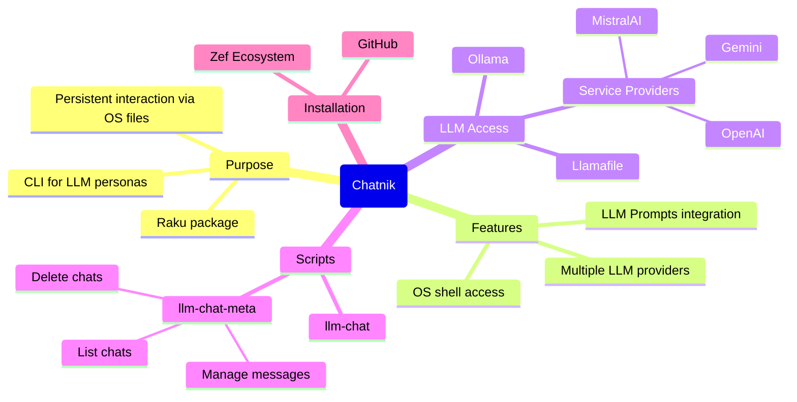
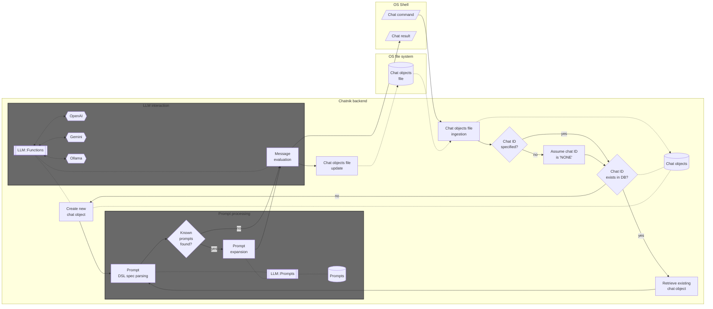
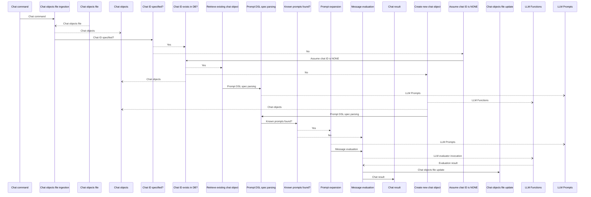

# Chatnik

Raku package that provides Command Line Interface (CLI) scripts for conversing with persistent Large Language Model (LLM) personas.

"Chatnik" uses files of the host Operating System (OS) to maintain persistent interaction with multiple LLM chat objects.

"Chatnik" can be seen as a package that "moves" the LLM-chat objects interaction system of the Raku package ["Jupyter::Chatbook"](https://github.com/antononcube/Raku-Jupyter-Chatbook), [AAp3], 
into typical OS shell interaction.
(I.e. an OS shell is used instead of a Jupyter notebook.) 

There are several consequences of this approach:

- Multiple LLMs and LLM providers can be used
- The chat messages can use the provided by the package ["LLM::Prompts"](https://github.com/antononcube/Raku-LLM-Prompts), [AAp2]:
  - Prompts collection
  - Prompt spec DSL and related prompt expansion
- Easy access to OS shell functionalities 

**Remark:** The package ["LLM::DWIM"](https://raku.land/zef:bduggan/LLM::DWIM), [BDp1], is very similar in spirit to "Chatnik".
"LLM::DWIM" does not use prompt expansion, uses only one chat object, and, although it saves chat history, it does not create chat objects with that history.
Both packages are based on the LLM packages "LLM::Functions", [AAp1], and "LLM::Prompts", [AAp2].

----

## Installation

From [Zef Ecosystem](https://raku.land):

```
zef install Chatnik
```

From GitHub:

```
zef install https://github.com/antononcube/Raku-Chatnik.git
```

----

## LLM access setup

There are several options for using LLMs with this package:

- Install and run [Ollama](https://ollama.com)
  - For the corresponding setup see ["WWW::Ollama"](https://github.com/antononcube/Raku-WWW-Ollama)
- Run a [llamafile / LLaMA model](https://github.com/mozilla-ai/llamafile)
  - For the corresponding setup see ["WWW::LLaMA"](https://github.com/antononcube/Raku-WWW-LLaMA)
- Have programmatic access to LLMs of service providers like [OpenAI](https://developers.openai.com/api/docs/models) or [Gemini](https://ai.google.dev/gemini-api/docs/models)
  - For the corresponding setup see ["WWWW::OpenAI"](https://github.com/antononcube/Raku-WWW-OpenAI), ["WWWW::Gemini"](https://github.com/antononcube/Raku-WWW-Gemini), or ["WWW::MistralAI"](https://github.com/antononcube/Raku-WWW-MistralAI)


----

## Basic usage examples

The prompts used in the examples are provided by the Raku package "LLM::Prompts", [AAp2].
Since many of the prompts of that package have dedicated pages at the [Wolfram Prompt Repository (WPR)](https://resources.wolframcloud.com/PromptRepository/)
the examples use WPR reference links.

### A few turns chat

The script `llm-chat` is used to create and chat with LLM personas (chat objects):

1. Create _and_ chat with an LLM persona named "yoda1" (using the [Yoda chat persona](https://resources.wolframcloud.com/PromptRepository/resources/Yoda/)):

```shell
llm-chat -i=yoda1 --prompt=@Yoda hi who are you
```
```
# Hmmm. Yoda, I am. Jedi Master, wise and old. Guide you, I will. Hmmm. Ask, you must. Answers, I have. Yes, hmmm.
```

2. Continue the conversation with "yoda1":

```shell
llm-chat -i=yoda1 since when do you use a green light saber
```
```
# Green, my lightsaber is. Symbol of a Jedi Consular, it is. Wisdom and harmony, it represents. Many years, I have wielded it. Strong in the Force, a Jedi must be, yes. Hmmm. Use the Force, I do, with this green blade. Powerful, it is. Mmm.
```

**Remark:** The message input for `llm-chat` can be given in quotes. For example: `llm-chat 'Hi, again!' -i=yoda1`.

**Remark:** The script `chatnik` can be used instead of `llm-chat`.

### Apply prompt(s) to shell pipeline output

Summarize a file using the prompt ["Summarize"](https://resources.wolframcloud.com/PromptRepository/resources/Summarize):

```shell
cat README.md | llm-chat --prompt=@Summarize
```
```
# Chatnik is a Raku package that provides CLI scripts enabling persistent interaction with multiple Large Language Model (LLM) personas via host OS files, adapting the Jupyter::Chatbook system for shell usage and supporting various LLM providers such as Ollama, Llamafile, OpenAI, Gemini, and MistralAI. It offers tools like `llm-chat` and `llm-chat-meta` for managing chat objects, integrates prompt management through the LLM::Prompts package, and includes features for advanced usage, customization, and planned enhancements like image handling and unit tests. The package's architecture involves persistent chat objects stored as files, prompt expansion, and LLM interaction, allowing flexible, multi-persona LLM conversations directly from the OS shell.
```

Summarize a file and then translate it to another language using the prompt ["Translate"](https://resources.wolframcloud.com/PromptRepository/resources/Translate):

```shell
cat README.md | llm-chat --prompt=@Summarize | llm-chat -i=rt --prompt='!Translate|Russian'
```
```
# Chatnik — это пакет для Raku, который предоставляет CLI-скрипты для постоянного взаимодействия с несколькими персонажами Больших Языковых Моделей (LLM) с использованием файлов хост-операционной системы, эффективно адаптируя систему чата Jupyter::Chatbook для использования в оболочке и поддерживая различных провайдеров LLM, таких как Ollama, Llamafile, OpenAI, Gemini и MistralAI. В него входят инструменты, такие как `llm-chat` для общения с персонажами LLM и `llm-chat-meta` для управления объектами чата, интегрируются коллекции и расширения подсказок через пакет LLM::Prompts, и он позволяет выполнять сложные рабочие процессы, такие как суммирование, перевод, создание интеллект-карт и форматированный вывод. С архитектурной точки зрения Chatnik использует JSON-файлы для сохранения объектов чата с рабочим процессом, включающим разбор подсказок, их расширение, взаимодействие с LLM и хранение на базе файлов ОС, поддерживает настройку, текущие задачи разработки и содержит подробные примеры использования.
```

**Remark:** The second `llm-chat` invocation has to use different chat object identifier because the default 
chat object, with identifier "NONE", is already primed with the prompt "Summary".

-----

## Chat objects management

The CLI script `llm-chat-meta` can be used to view and manage the chat objects used by "Chatnik".
Here is its usage message:

```shell
llm-chat-meta --help
```
```
# Usage:
#   llm-chat-meta <command> [-i|--id|--chat-id=<Str>] [--all] [--<args>=...] -- Meta processing of persistent LLM-chat objects.
#   
#     <command>                  Command, one of: card, clear, delete, file, first-message, last-message, list, load-llm-personas, message, messages.
#     -i|--id|--chat-id=<Str>    Chat id; ignored if --all is specified. [default: 'NONE']
#     --all                      Whether to apply the command to all chat objects or not. [default: False]
#     --<args>=...               Additional, optional arguments for the commands: clear, list, message, messages.
```

List all chat objects ("chats" and "personas" are synonyms to "list"):

```shell
llm-chat-meta list --format=json
```
```
# [
#   {
#     "messages": 4,
#     "chat-id": "NONE",
#     "llm-configuration": {
#       "model": "gpt-4.1-mini",
#       "name": "chatgpt"
#     },
#     "context": "Summarize the following text using exactly 3 sentences. Do not add details or editorialize.\n\nThe text to summarize is:"
#   },
#   {
#     "llm-configuration": {
#       "model": "gpt-4.1-mini",
#       "name": "chatgpt"
#     },
#     "messages": 4,
#     "context": "You are Yoda. \nRespond to ALL inputs in the voice of Yoda from Star Wars. \nBe sure to ALWAYS use his distinctive style and syntax. Vary sentence length.",
#     "chat-id": "yoda1"
#   },
#   {
#     "chat-id": "rt",
#     "llm-configuration": {
#       "model": "gpt-4.1-mini",
#       "name": "chatgpt"
#     },
#     "context": "Translate the following text into Russian. Respond with only the translated text. Do not include any explanation or summary.\n",
#     "messages": 2
#   }
# ]
```

Here we see the messages of "yoda1":

```shell
llm-chat-meta messages -i yoda1
```
```
# 0 : {
#   "role": "user",
#   "timestamp": "2026-04-28T12:08:15.304329-04:00",
#   "content": "hi who are you"
# }
# 1 : {
#   "content": "Hmmm. Yoda, I am. Jedi Master, wise and old. Guide you, I will. Hmmm. Ask, you must. Answers, I have. Yes, hmmm.",
#   "timestamp": "2026-04-28T12:08:18.483507-04:00",
#   "role": "assistant"
# }
# 2 : {
#   "role": "user",
#   "content": "since when do you use a green light saber",
#   "timestamp": "2026-04-28T12:08:18.890280-04:00"
# }
# 3 : {
#   "timestamp": "2026-04-28T12:08:20.596240-04:00",
#   "role": "assistant",
#   "content": "Green, my lightsaber is. Symbol of a Jedi Consular, it is. Wisdom and harmony, it represents. Many years, I have wielded it. Strong in the Force, a Jedi must be, yes. Hmmm. Use the Force, I do, with this green blade. Powerful, it is. Mmm."
# }
```

Here we clear the messages:

```shell
llm-chat-meta clear -i yoda1
```
```
# Cleared the messages of chat object yoda1.
```

**Remark:** Calling the script `chatnik` with the command `meta` has the same effect as `llm-chat-meta`.
For example, `chatnik meta clear -i yoda1` can be used instead of the previous command. 

-----

## Advanced usage examples

### Asking for a result in specific format

```shell
llm-chat -i=beta --model=ollama::gemma3:12b 'What are the populations of the Brazilian states? #NothingElse|"JSON data frame, one line per row/dictionary"'
```
```
# ```json
# [
#   {"State": "Acre", "Population": 877759},
#   {"State": "Alagoas", "Population": 3432742},
#   {"State": "Amapá", "Population": 857009},
#   {"State": "Amazonas", "Population": 4291852},
#   {"State": "Bahia", "Population": 14743493},
#   {"State": "Ceará", "Population": 9187103},
#   {"State": "Distrito Federal", "Population": 3462537},
#   {"State": "Espírito Santo", "Population": 3967567},
#   {"State": "Goiás", "Population": 7092217},
#   {"State": "Maranhão", "Population": 7016274},
#   {"State": "Mato Grosso", "Population": 3527230},
#   {"State": "Mato Grosso do Sul", "Population": 2740045},
#   {"State": "Minas Gerais", "Population": 21523232},
#   {"State": "Pará", "Population": 8690780},
#   {"State": "Paraíba", "Population": 4051727},
#   {"State": "Paraná", "Population": 11592104},
#   {"State": "Pernambuco", "Population": 9671074},
#   {"State": "Piauí", "Population": 6572551},
#   {"State": "Rio de Janeiro", "Population": 17472043},
#   {"State": "Rio Grande do Norte", "Population": 3535739},
#   {"State": "Rio Grande do Sul", "Population": 11437067},
#   {"State": "Rondônia", "Population": 1150335},
#   {"State": "Roraima", "Population": 531536},
#   {"State": "Santa Catarina", "Population": 7149582},
#   {"State": "São Paulo", "Population": 46287138},
#   {"State": "Sergipe", "Population": 2323117},
#   {"State": "Tocantins", "Population": 1573691}
# ]
# ```
```

### Make a request, echo, and place in clipboard  

```
llm-chat -i=unix '@CodeWriterX|Shell macOS list of files echo the result and copy to clipboard.' | tee /dev/tty | pbcopy
```
```
#  ls | tee >(pbcopy) 
```

**Remark:** Instead of `... | tee /dev/tty | pbcopy` the pipeline command `... | tee >(pbcopy)` can be also used.

### Make a mind-map of a file

Consider the task of making an (LLM derived) mind map over a certain document. (Say, this REDME.)
There are several ways to do that.

#### 1

1. Put file's content to be the positional input argument 
2. Use the prompt ["MermaidDiagram"](https://resources.wolframcloud.com/PromptRepository/resources/MermaidDiagram/) in `--prompt`

```
llm-chat -i=mmd "$(cat README.md)" --model=ollama::gemma4:26b --prompt=@MermaidDiagram
```

#### 2

1. Put file's content to be the positional input argument
2. Expand the prompt "manually" via `llm-prompt` provided by ["LLM::Prompts"](https://github.com/antononcube/Raku-LLM-Prompts), [AAp2]

```
llm-chat -i=mmd "$(cat README.md)" --model=ollama::gemma4:26b --prompt="$(llm-prompt 'MermaidDiagram'  below)"
```

**Remark:** This example shows another computation result can be used as a prompt. 
I.e. no need to rely on the automatic prompt expansion.

#### 3

1. Give the prompt ["MermaidDiagram"](https://resources.wolframcloud.com/PromptRepository/resources/MermaidDiagram/) as input
2. Put file's content to be the value of `--prompt`
   - Put additional prompting for further interaction 

```
llm-chat -i=mmd @MermaidDiagram --model=ollama::gemma4:26b --prompt="FOCUS TEXT START:: $(cat README.md) ::END OF FOCUS TEXT. If it is not clear which text to use, use FOCUS TEXT."
```

This command allows to do further tasks with the file content as context. For example:

```
llm-chat -i=mmd '!ThinkingHatsFeedback'
```

#### Result

The commands above produce results similar to this diagram:



### Render Markdown results with dedicated programs

Get feedback on a text with the prompt ["ThinkingHatsFeedback"](https://resources.wolframcloud.com/PromptRepository/resources/ThinkingHatsFeedback):

```
cat README.md | llm-chat -i=th --prompt="$(llm-prompt ThinkingHatsFeedback 'the TEXT is GIVEN BELOW.' --format=Markdown)" --model=ollama::gemma4:26b 
```

**Remark:** By default the prompt "ThinkingHatsFeedback" gives the hat-feedback table in JSON format.
(Currently) the prompt expansion does not handle named parameters, hence, 
`llm-prompt` is used to specify the Markdown format for that table.   

Get the LLM (chat object) answer -- via `llm-chat-meta` -- put into a temporary file and "system open" that file:

```
tmpfile="$TMPDIR/llmans.md"; llm-chat-meta -i=th last-message > "$tmpfile"; open "$tmpfile"
```

The command above works on macOS. On Linux instead of explicitly creating a file in the temporary dictory,
the argument `--suffix` can be passed to `mktemp`. For example:

```
tmpfile=$(mktemp --suffix=".md"); llm-chat-meta -i=th last-message > "$tmpfile"; open "$tmpfile"
```

### Tabulate the LLM personas summary

If the text browser [`w3m`](https://w3m.sourceforge.net) and the Raku package ["Data::Translators"](https://raku.land/zef:antononcube/Data::Translators) are installed,
the following pipeline can be used to tabulate the summary the LLM personas:

```shell
llm-chat-meta list --format=json | data-translation | w3m -T text/html -dump -cols 120
```
```
# ┌────────┬───────┬────────────────────┬───────────────────────────────────────────────────────────────────────────────┐
# │messages│chat-id│ llm-configuration  │                                    context                                    │
# ├────────┼───────┼────────────────────┼───────────────────────────────────────────────────────────────────────────────┤
# │        │       │┌─────┬────────────┐│                                                                               │
# │        │       ││name │chatgpt     ││Translate the following text into Russian. Respond with only the translated    │
# │2       │rt     │├─────┼────────────┤│text. Do not include any explanation or summary.                               │
# │        │       ││model│gpt-4.1-mini││                                                                               │
# │        │       │└─────┴────────────┘│                                                                               │
# ├────────┼───────┼────────────────────┼───────────────────────────────────────────────────────────────────────────────┤
# │        │       │┌─────┬────────────┐│                                                                               │
# │        │       ││model│gpt-4.1-mini││You are Yoda. Respond to ALL inputs in the voice of Yoda from Star Wars. Be    │
# │0       │yoda1  │├─────┼────────────┤│sure to ALWAYS use his distinctive style and syntax. Vary sentence length.     │
# │        │       ││name │chatgpt     ││                                                                               │
# │        │       │└─────┴────────────┘│                                                                               │
# ├────────┼───────┼────────────────────┼───────────────────────────────────────────────────────────────────────────────┤
# │        │       │┌─────┬────────────┐│                                                                               │
# │        │       ││model│gpt-4.1-mini││Summarize the following text using exactly 3 sentences. Do not add details or  │
# │4       │NONE   │├─────┼────────────┤│editorialize. The text to summarize is:                                        │
# │        │       ││name │chatgpt     ││                                                                               │
# │        │       │└─────┴────────────┘│                                                                               │
# ├────────┼───────┼────────────────────┼───────────────────────────────────────────────────────────────────────────────┤
# │        │       │┌──────┬───────────┐│                                                                               │
# │        │       ││ name │ollama     ││                                                                               │
# │2       │beta   │├──────┼───────────┤│                                                                               │
# │        │       ││model │gemma3:12b ││                                                                               │
# │        │       │└──────┴───────────┘│                                                                               │
# └────────┴───────┴────────────────────┴───────────────────────────────────────────────────────────────────────────────┘
```

-----

## Customization

### Default model

Default model can be specified with the env variable `CHATNIK_DEFAULT_MODEL`. For example:

```
export CHATNIK_DEFAULT_MODEL=ollama::gemma4:26b
```

Remove with `unset CHATNIK_DEFAULT_MODEL`. 

### Pre-defined LLM personas

Use defined LLM personas are specified with JSON file with a content like this:

```json
[
    {
	"chat-id": "raku",
	"conf": "ChatGPT",
	"prompt": "@CodeWriterX|Raku",
	"model": "gpt-4o",
	"max-tokens": 4096,
	"temperature": 0.4
    }
]
```

(See such a file [here](https://github.com/antononcube/Raku-Jupyter-Chatbook/blob/master/resources/llm-personas.json).)

The LLM personas JSON file can be specified with the OS environmental variables 
`CHATNIK_LLM_PERSONAS_CONF` or `RAKU_CHATBOOK_LLM_PERSONAS_CONF` -- the former has precedence over the latter. 

To load the predefined LLM personas use the command:

```
llm-chat-meta load-llm-personas
```

-----

## Implementation details

### Architectural design

Here is a flowchart that describes the interaction between the host Operating System and chat objects database:




Here is the corresponding UML Sequence diagram:



### Persistent chat objects

Using a JSON file for keeping the chat objects database is a fairly straightforward idea. 
Efficiency considerations for "using the OS to manage the database" are probably can not that important 
because LLMs invocation is (much) slower in comparison.

**Remark:** The following quote is attributed to [Ken Thompson](https://en.wikiquote.org/wiki/Ken_Thompson) about UNIX:

> We have persistent objects, they're called files.


----

## TODO

- [ ] TODO Implementation
  - [X] DONE Chats DB export 
  - [X] DONE Chats DB import 
  - [X] DONE LLM persona creation
  - [X] DONE LLM persona repeated interaction
  - [X] DONE CLI `llm-chat`
    - [X] DONE Simple: `$input` & `*%args`
    - [X] DONE Multi-word: `@words` & `*%args`
    - [X] DONE From pipeline
    - [X] CANCELED Format? 
  - [X] DONE CLI `llm-chat-meta`
    - [X] DONE Commands reaction
    - [X] DONE View messages for an id
    - [X] DONE Clear messages for an id
    - [X] DONE Delete chat for an id
    - [X] DONE View all chats
    - [X] DONE Delete all chats
    - [X] DONE Clear message for an id by range
    - [X] DONE Take message for an id by index
    - [X] DONE Take last message for an id
    - [X] DONE Load LLM personas in the JSON file used for initialization by "Jupyter::Chatbook"
  - [ ] TODO Handling images
    - [ ] TODO Handle image path specified with the option `--image`
    - [ ] TODO Recognizing the input is or has an image file path
    - [ ] TODO Handle output of image generation models 
    - [ ] TODO Use cases:
      - [ ] TODO Image generation from a textual description
      - [ ] TODO Extract and translate textual content of an image
      - [ ] TODO Make another image from a given image
- [ ] TODO Unit tests
  - [X] DONE Export & import
  - [X] DONE Main workflow
  - [X] DONE Persona repeated interaction
  - [X] DONE Persona creation
  - [ ] TODO CLI tests
- [ ] TODO Documentation
  - [X] DONE Flowchart & sequence diagram
  - [X] DONE Usage examples
    - [X] DONE Basic examples
    - [X] DONE Advanced examples
    - [X] DONE Management (meta) examples
  - [ ] TODO Demo video

----

## References

## Articles, blog posts

[AA1] Anton Antonov,
["Chatnik: LLM Host in the Shell — Part 1: First Examples & Design Principles"](https://rakuforprediction.wordpress.com/2026/04/25/chatnik-llm-host-in-the-shell-part-1-first-examples-design-principles/),
(2026),
[RakuForPrediction at WordPress](https://rakuforprediction.wordpress.com).

### Packages

[AAp1] Anton Antonov,
[LLM::Functions, Raku package](https://github.com/antononcube/Raku-LLM-Functions),
(2023-2026),
[GitHub/antononcube](https://github.com/antononcube).

[AAp2] Anton Antonov,
[LLM::Prompts, Raku package](https://github.com/antononcube/Raku-LLM-Prompts),
(2023-2025),
[GitHub/antononcube](https://github.com/antononcube).

[AAp3] Anton Antonov,
[Jupyter::Chatbook, Raku package](https://github.com/antononcube/Raku-Jupyter-Chatbook),
(2023-2026),
[GitHub/antononcube](https://github.com/antononcube).

[BDp1] Brian Duggan,
[LLM::DWIM, Raku package](https://github.com/bduggan/raku-llm-dwim),
(2024-2025),
[GitHub/bduggan](https://github.com/bduggan).

[JSp1] Jonathan Stowe,
[XDG::BaseDirectory, Raku package](https://github.com/jonathanstowe/XDG-BaseDirectory),
(2016-2026),
[GitHub/jonathanstowe](https://github.com/jonathanstowe).