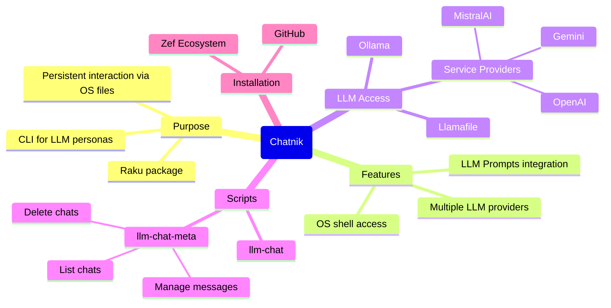
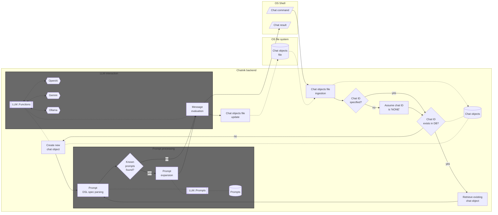
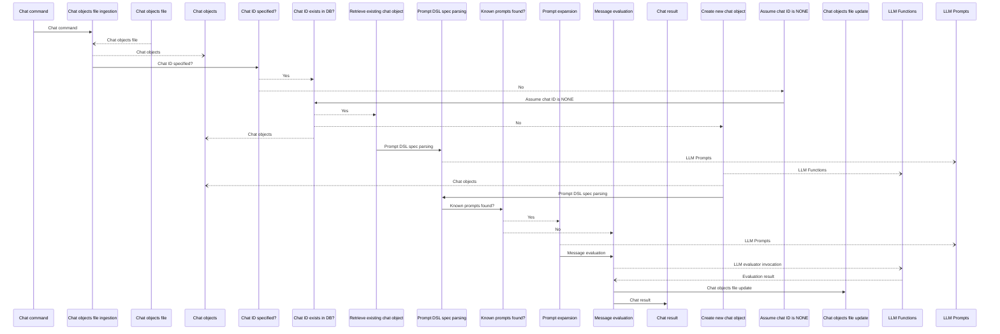

# Chatnik

Raku package that provides Command Line Interface (CLI) scripts for conversing with persistent Large Language Model (LLM) personas.

"Chatnik" uses files of the host Operating System (OS) to maintain persistent interaction with multiple LLM chat objects.

"Chatnik" simply moves the LLM-chat objects interaction system of the Raku package ["Jupyter::Chatbook"](https://github.com/antononcube/Raku-Jupyter-Chatbook), [AAp3], 
into a UNIX-like OS terminal interaction.
(I.e. an OS shell is used instead of a Jupyter notebook.) 

There are several consequences of this approach:

- Multiple LLMs and LLM provider can be used
- The chat messages can use the provided by the package ["LLM::Prompts"](https://github.com/antononcube/Raku-LLM-Prompts), [AAp2]:
  - Prompts collection
  - Prompt spec DSL and related prompt expansion
- Easy access to OS shell functionalities 

----

## Installation

From [Zef Ecosystem](https://raku.land):

```
zef install Chatnik
```

From GitHub:

```
zef install https://github.com/antononcube/Raku-Chatnik.git
```

----

## LLM access setup

There are several options for using LLMs with this package:

- Install and run [Ollama](https://ollama.com)
  - For the corresponding setup see ["WWW::Ollama"](https://github.com/antononcube/Raku-WWW-Ollama)
- Run a [llamafile / LLaMA model](https://github.com/mozilla-ai/llamafile)
  - For the corresponding setup see ["WWW::LLaMA"](https://github.com/antononcube/Raku-WWW-LLaMA)
- Have programmatic access to LLMs of service providers like [OpenAI](https://developers.openai.com/api/docs/models) or [Gemini](https://ai.google.dev/gemini-api/docs/models)
  - For the corresponding setup see ["WWWW::OpenAI"](https://github.com/antononcube/Raku-WWW-OpenAI), ["WWWW::Gemini"](https://github.com/antononcube/Raku-WWW-Gemini), or ["WWW::MistralAI"](https://github.com/antononcube/Raku-WWW-MistralAI)


----

## Basic usage examples

The prompts used in the examples are provided by the Raku package "LLM::Prompts", [AAp2].
Since many of the prompts of that package have dedicated pages at the [Wolfram Prompt Repository (WPR)](https://resources.wolframcloud.com/PromptRepository/)
the examples use WPR reference links.

### A few turns chat

The script `llm-chat` is used to create and chat with LLM personas (chat objects):

1. Create _and_ chat with an LLM persona named "yoda1" (using the [Yoda chat persona](https://resources.wolframcloud.com/PromptRepository/resources/Yoda/)):

```shell
llm-chat -i=yoda1 --prompt=@Yoda hi who are you
```
```
# Hmmm. Yoda, I am. A Jedi Master, wise and old. Guide you, I will, if listen you do. Yes, hmmm.
```

2. Continue the conversation with "yoda1":

```shell
llm-chat -i=yoda1 since when do you use a green light saber
```
```
# Since long ago, green my lightsaber has been. Symbol of a Jedi Consular, it is. Focus on wisdom and harmony, they do. Powerful in the Force, green blades are. Hmm, yes.
```

**Remark:** The message input for `llm-chat` can be given in quotes. For example: `llm-chat 'Hi, again!' -i=yoda1`.

### Apply prompt(s) to shell pipeline output

Summarize a file using the prompt ["Summarize"](https://resources.wolframcloud.com/PromptRepository/resources/Summarize):

```shell
cat README.md | llm-chat --prompt=@Summarize
```
```
# Chatnik is a Raku package that provides CLI scripts enabling persistent conversations with multiple Large Language Model (LLM) personas by using host OS files to manage chat objects, adapting the interaction model of the Jupyter::Chatbook package to a UNIX-like terminal environment. It supports various LLM providers including Ollama, Llamafile, OpenAI, Gemini, and MistralAI, integrates with the LLM::Prompts package for prompt management, and offers commands like `llm-chat` and `llm-chat-meta` for chatting and managing chat objects, which are stored in JSON files. The package features detailed usage examples, architectural flowcharts, and is under active development with ongoing work on testing, documentation, and additional CLI features.
```

Summarize a file and then translate it to another language using the prompt ["Translate"](https://resources.wolframcloud.com/PromptRepository/resources/Translate):

```shell
cat README.md | llm-chat --prompt=@Summarize | llm-chat -i=rt --prompt='!Translate|Russian'
```
```
# Chatnik — это пакет для Raku, предоставляющий CLI-скрипты для постоянных разговоров с несколькими персонажами Больших Языковых Моделей (LLM) с использованием файлов хост-операционной системы для управления объектами чата, адаптирующий систему взаимодействия пакета Jupyter::Chatbook в терминальную среду, похожую на UNIX. Он поддерживает нескольких провайдеров LLM, включая Ollama, Llamafile, OpenAI, Gemini и MistralAI, интегрируется с пакетом LLM::Prompts для управления подсказками и предлагает команды, такие как `llm-chat` для общения и `llm-chat-meta` для управления объектами чата, хранящимися в JSON-файлах. Пакет включает подробные примеры использования, архитектурные диаграммы и находится в активной разработке с текущими задачами по улучшению CLI, модульному тестированию и документации.
```

**Remark:** The second `llm-chat` invocation has to use different chat object identifier because the default 
chat object, with identifier "NONE", is already primed with the prompt "Summary".

-----

## Chat objects management

The CLI script `llm-chat-meta` can be used to view and manage the chat objects used by "Chatnik".
Here is its usage message:

```shell
llm-chat-meta --help
```
```
# Usage:
#   llm-chat-meta <command> [-i|--id|--chat-id=<Str>] [--all] [--<args>=...] -- Meta processing of persistent LLM-chat objects.
#   
#     <command>                  Command, one of: card, clear, delete, file, last-message, list, message, messages.
#     -i|--id|--chat-id=<Str>    Chat id; ignored if --all is specified. [default: '']
#     --all                      Whether to apply the command to all chat objects or not. [default: False]
#     --<args>=...               Additional, optional arguments for the commands: clear, message, messages.
```

List all chat objects ("chats" and "personas" are synonyms to "list"):

```shell
llm-chat-meta list
```
```
# {chat-id => yoda1, context => You are Yoda. 
# Respond to ALL inputs in the voice of Yoda from Star Wars. 
# Be sure to ALWAYS use his distinctive style and syntax. Vary sentence length., messages => 4}
# {chat-id => latex, context => You are Code Writer and as the coder that you are, you provide clear and concise code only, without explanation nor conversation. 
# Your job is to output code with no accompanying text.
# Do not explain any code unless asked. Do not provide summaries unless asked.
# You are the best LaTeX programmer in the world but do not converse.
# You know the LaTeX documentation better than anyone but do not converse.
# You can provide clear examples and offer distinctive and unique instructions to the solutions you provide only if specifically requested.
# Only code in LaTeX unless told otherwise.
# Unless they ask, you will only give code., messages => 2}
# {chat-id => rt, context => Translate the following text into Russian. Respond with only the translated text. Do not include any explanation or summary.
# , messages => 2}
# {chat-id => NONE, context => Summarize the following text using exactly 3 sentences. Do not add details or editorialize.
# 
# The text to summarize is:, messages => 4}
# {chat-id => raku, context => You are Code Writer and as the coder that you are, you provide clear and concise code only, without explanation nor conversation. 
# Your job is to output code with no accompanying text.
# Do not explain any code unless asked. Do not provide summaries unless asked.
# You are the best Raku programmer in the world but do not converse.
# You know the Raku documentation better than anyone but do not converse.
# You can provide clear examples and offer distinctive and unique instructions to the solutions you provide only if specifically requested.
# Only code in Raku unless told otherwise.
# Unless they ask, you will only give code., messages => 0}
# {chat-id => ce, context => Perform basic copy editing on the following text, correcting errors in grammar, spelling and punctuation; improvements to style and clarity may also be made, but do not make more significant changes to content or structure: , messages => 0}
# {chat-id => gc, context => You are Code Writer and as the coder that you are, you provide clear and concise code only, without explanation nor conversation. 
# Your job is to output code with no accompanying text.
# Do not explain any code unless asked. Do not provide summaries unless asked.
# You are the best Google Charts programmer in the world but do not converse.
# You know the Google Charts documentation better than anyone but do not converse.
# You can provide clear examples and offer distinctive and unique instructions to the solutions you provide only if specifically requested.
# Only code in Google Charts unless told otherwise.
# Unless they ask, you will only give code.
# When asked about options give only options code not complete HTML code.
# Unless they say differently give your options answers as Raku code., messages => 0}
# {chat-id => html, context => You are Code Writer and as the coder that you are, you provide clear and concise code only, without explanation nor conversation. 
# Your job is to output code with no accompanying text.
# Do not explain any code unless asked. Do not provide summaries unless asked.
# You are the best HTML programmer in the world but do not converse.
# You know the HTML documentation better than anyone but do not converse.
# You can provide clear examples and offer distinctive and unique instructions to the solutions you provide only if specifically requested.
# Only code in HTML unless told otherwise.
# Unless they ask, you will only give code., messages => 0}
```

Here we see the messages of "yoda1":

```shell
llm-chat-meta messages -i yoda1
```
```
# 0 : {
#   "content": "hi who are you",
#   "timestamp": "2026-04-20T14:34:41.171787-04:00",
#   "role": "user"
# }
# 1 : {
#   "role": "assistant",
#   "content": "Hmmm. Yoda, I am. A Jedi Master, wise and old. Guide you, I will, if listen you do. Yes, hmmm.",
#   "timestamp": "2026-04-20T14:34:43.767983-04:00"
# }
# 2 : {
#   "timestamp": "2026-04-20T14:34:44.184697-04:00",
#   "content": "since when do you use a green light saber",
#   "role": "user"
# }
# 3 : {
#   "content": "Since long ago, green my lightsaber has been. Symbol of a Jedi Consular, it is. Focus on wisdom and harmony, they do. Powerful in the Force, green blades are. Hmm, yes.",
#   "timestamp": "2026-04-20T14:34:45.982946-04:00",
#   "role": "assistant"
# }
```

Here we clear the messages:

```shell
llm-chat-meta clear -i yoda1
```
```
# Cleared the messages of chat object yoda1.
```

-----

## Advanced usage examples

### Asking for a result in specific format

```shell
llm-chat -i=beta --model=ollama::gemma3:12b 'What are the populations of the Brazilian states? #NothingElse|JSON' 
```
```
# ```json
# {
#   "Acre": 860058,
#   "Alagoas": 3204261,
#   "Amapá": 846793,
#   "Amazonas": 4278398,
#   "Bahia": 14703894,
#   "Ceará": 9187103,
#   "Distrito Federal": 3045045,
#   "Espírito Santo": 3967592,
#   "Goiás": 7049185,
#   "Maranhão": 7016274,
#   "Mato Grosso": 3515000,
#   "Mato Grosso do Sul": 3131851,
#   "Minas Gerais": 21391370,
#   "Pará": 8690722,
#   "Paraíba": 4051637,
#   "Paraná": 11474000,
#   "Pernambuco": 9675773,
#   "Piauí": 6576495,
#   "Rio de Janeiro": 17425717,
#   "Rio Grande do Norte": 3377573,
#   "Rio Grande do Sul": 11365360,
#   "Rondônia": 1163077,
#   "Roraima": 517094,
#   "Santa Catarina": 7149583,
#   "São Paulo": 46278532,
#   "Sergipe": 2251159,
#   "Tocantins": 1572827
# }
# ```
```

### Make a request, echo, and place in clipboard  

```shell
llm-chat -i=unix '@CodeWriterX|Shell macOS list of files echo the result and copy to clipboard.' | tee /dev/tty | pbcopy
```
```
# 
```

**Remark:** Instead of `... | tee /dev/tty | pbcopy` the pipeline command `... | tee >(pbcopy)` can be also used.

### Make a mind-map of a file

Consider the task of making an (LLM derived) mind map over a certain document. (Say, this REDME.)
There are several ways to do that.

#### 1

1. Put file's content to be the positional input argument 
2. Use the prompt ["MermaidDiagram"](https://resources.wolframcloud.com/PromptRepository/resources/MermaidDiagram/) in `--prompt`

```
llm-chat -i=mmd "$(cat README.md)" --model=ollama::gemma4:26b --prompt=@MermaidDiagram
```

#### 2

1. Put file's content to be the positional input argument
2. Expand the prompt "manually" via `llm-prompt` provided by ["LLM::Prompts"](https://github.com/antononcube/Raku-LLM-Prompts), [AAp2]

```
llm-chat -i=mmd "$(cat README.md)" --model=ollama::gemma4:26b --prompt="$(llm-prompt 'MermaidDiagram'  below)"
```

**Remark:** This example shows another computation result can be used as a prompt. 
I.e. no need to rely on the automatic prompt expansion.

#### 3

1. Give the prompt ["MermaidDiagram"](https://resources.wolframcloud.com/PromptRepository/resources/MermaidDiagram/) as input
2. Put file's content to be the value of `--prompt`
   - Put additional prompting for further interaction 

```
llm-chat -i=mmd @MermaidDiagram --model=ollama::gemma4:26b --prompt="FOCUS TEXT START:: $(cat README.md) ::END OF FOCUS TEXT. If it is not clear which text to use, use FOCUS TEXT."
```

This command allows to do further tasks with the file content as context. For example:

```
llm-chat -i=mmd '!ThinkingHatsFeedback'
```

#### Result

The commands above produce results similar to this diagram:



### Render results Markdown with dedicated programs

Get feedback on a text with the prompt ["ThinkingHatsFeedback"](https://resources.wolframcloud.com/PromptRepository/resources/ThinkingHatsFeedback):

```
cat README.md | llm-chat -i=th --prompt="$(llm-prompt ThinkingHatsFeedback 'the TEXT is GIVEN BELOW.' --format=Markdown)" --model=ollama::gemma4:26b 
```

**Remark:** By default the prompt "ThinkingHatsFeedback" gives the hat-feedback table in JSON format.
(Currently) the prompt expansion does not handle named parameters, hence, 
`llm-prompt` is used to specify the Markdown format for that table.   

Get the LLM (chat object) answer -- via `llm-chat-meta` -- put into a temporary file and "system open" that file:

```
tmpfile="$TMPDIR/llmans.md"; llm-chat-meta -i=th last-message > "$tmpfile"; open "$tmpfile"
```

The command above works on macOS. On Linux instead of explicitly creating a file in the temporary dictory,
the argument `--suffix` can be passed to `mktemp`. For example:

```
tmpfile=$(mktemp --suffix=".md"); llm-chat-meta -i=th last-message > "$tmpfile"; open "$tmpfile"
```

-----

## Implementation details

### Architectural design

Here is a flowchart that describes the interaction between the host Operating System and chat objects database:




Here is the corresponding UML Sequence diagram:



### Persistent chat objects

Using a JSON file for keeping the chat objects database is a fairly straightforward idea. 
Efficiency considerations for "using the OS to manage the database" are probably can not that important 
because LLMs invocation is (much) slower in comparison.

**Remark:** The following quote is attributed to [Ken Thompson](https://en.wikiquote.org/wiki/Ken_Thompson) about UNIX:

> We have persistent objects, they're called files.


----

## TODO

- [ ] TODO Implementation
  - [X] DONE Chats DB export 
  - [X] DONE Chats DB import 
  - [X] DONE LLM persona creation
  - [X] DONE LLM persona repeated interaction
  - [X] DONE CLI `llm-chat`
    - [X] DONE Simple: `$input` & `*%args`
    - [X] DONE Multi-word: `@words` & `*%args`
    - [X] DONE From pipeline
    - [X] CANCELED Format? 
  - [X] DONE CLI `llm-chat-meta`
    - [X] DONE Commands reaction
    - [X] DONE View messages for an id
    - [X] DONE Clear messages for an id
    - [X] DONE Delete chat for an id
    - [X] DONE View all chats
    - [X] DONE Delete all chats
    - [X] DONE Clear message for an id by range
    - [X] DONE Take message for an id by index
    - [X] DONE Take last message for an id
    - [X] DONE Load LLM personas in the JSON file used for initialization by "Jupyter::Chatbook"
- [ ] TODO Unit tests
  - [X] DONE Export & import
  - [X] DONE Main workflow
  - [X] DONE Persona repeated interaction
  - [X] DONE Persona creation
  - [ ] TODO CLI tests
- [ ] TODO Documentation
  - [X] DONE Flowchart & sequence diagram
  - [X] DONE Usage examples
    - [X] DONE Basic examples
    - [X] DONE Advanced examples
    - [X] DONE Management (meta) examples
  - [ ] TODO Demo video

----

## References

### Packages

[AAp1] Anton Antonov
[LLM::Functions, Raku package](https://github.com/antononcube/Raku-LLM-Functions),
(2023-2026),
[GitHub/antononcube](https://github.com/antononcube).

[AAp2] Anton Antonov
[LLM::Prompts, Raku package](https://github.com/antononcube/Raku-LLM-Prompts),
(2023-2025),
[GitHub/antononcube](https://github.com/antononcube).

[AAp3] Anton Antonov
[Jupyter::Chatbook, Raku package](https://github.com/antononcube/Raku-Jupyter-Chatbook),
(2023-2026),
[GitHub/antononcube](https://github.com/antononcube).

[JSp1] Jonathan Stowe,
[XDG::BaseDirectory, Raku package](https://github.com/jonathanstowe/XDG-BaseDirectory),
(2016-2026),
[GitHub/jonathanstowe](https://github.com/jonathanstowe).