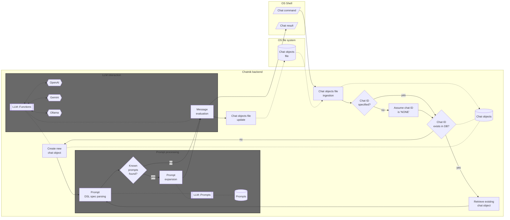
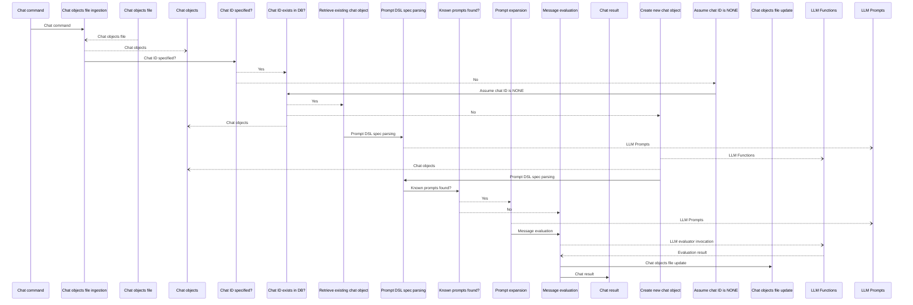

# Chatnik

Raku package that provides Command Line Interface (CLI) scripts for conversing with persistent Large Language Model (LLM) personas.

"Chatnik" uses files of the host Operating System (OS) to maintain persistent interaction with multiple LLM chat objects.

"Chatnik" simply moves the LLM-chat objects interaction system of the Raku package ["Jupyter::Chatbook"](https://github.com/antononcube/Raku-Jupyter-Chatbook), [AAp3], 
into a UNIX-like OS terminal interaction.
(I.e. an OS shell is used instead of a Jupyter notebook.) 

There are several consequences of this approach:

- Multiple LLMs and LLM provider can be used
- The chat messages can use the provided by the package ["LLM::Prompts"](https://github.com/antononcube/Raku-LLM-Prompts), [AAp2]:
  - Prompts collection
  - Prompt spec DSL and related prompt expansion
- Easy access to OS shell functionalities 

----

## Installation

From [Zef Ecosystem](https://raku.land):

```
zef install Chatnik
```

From GitHub:

```
zef install https://github.com/antononcube/Raku-Chatnik.git
```

----

## LLM access setup

There are several options for using LLMs with this package:

- Install and run [Ollama](https://ollama.com)
  - For the corresponding setup see ["WWW::Ollama"](https://github.com/antononcube/Raku-WWW-Ollama)
- Run a [llamafile / LLaMA model](https://github.com/mozilla-ai/llamafile)
  - For the corresponding setup see ["WWW::LLaMA"](https://github.com/antononcube/Raku-WWW-LLaMA)
- Have programmatic access to LLMs of service providers like [OpenAI](https://developers.openai.com/api/docs/models) or [Gemini](https://ai.google.dev/gemini-api/docs/models)
  - For the corresponding setup see ["WWWW::OpenAI"](https://github.com/antononcube/Raku-WWW-OpenAI), ["WWWW::Gemini"](https://github.com/antononcube/Raku-WWW-Gemini), or ["WWW::MistralAI"](https://github.com/antononcube/Raku-WWW-MistralAI)


----

## Basic usage examples

### A few turns chat

The script `llm-chat` is used to create and chat with LLM personas (chat objects):

1. Create _and_ chat with an LLM persona named "yoda1" (using the [Yoda chat persona](https://resources.wolframcloud.com/PromptRepository/resources/Yoda/)):

```shell
llm-chat -i=yoda1 --prompt=@Yoda hi who are you
```
```
# Yoda, I am. Jedi Master, wise and old. Guide you, I will, if ready you are. Hmm. Yes.
```

2. Continue the conversation with "yoda1":

```shell
llm-chat -i=yoda1 since when do you use a green light saber
```
```
# Green, my lightsaber is, yes. A symbol of the Jedi Consular, it is. Wisdom and harmony, it represents. Many years have I wielded it, hmmm. Power and knowledge, balance they bring. Understand, you do?
```

**Remark:** The message input for `llm-chat` can be given in quotes. For example: `llm-chat 'Hi, again!' -i=yoda1`.

-----

## Chat objects management

The CLI script `llm-chat-meta` can be used to view and manage the chat objects used by "Chatnik".
Here is its usage message:

```shell
llm-chat-meta --help
```
```
# Usage:
#   llm-chat-meta <command> [-i|--id|--chat-id=<Str>] [--all] -- Meta processing of persistent LLM-chat objects.
#   
#     <command>                  Command, one of: clear, delete, file, list, messages.
#     -i|--id|--chat-id=<Str>    Chat id; ignored if --all is specified. [default: '']
#     --all                      Whether to apply the command to all chat objects or not. [default: False]
```

List all chat objects ("chats" and "personas" are synonyms to "list"):

```shell
llm-chat-meta list
```
```
# {chat-id => yoda1, context => You are Yoda. 
# Respond to ALL inputs in the voice of Yoda from Star Wars. 
# Be sure to ALWAYS use his distinctive style and syntax. Vary sentence length., messages => 4}
```

Here we see the messages of "yoda1":

```shell
llm-chat-meta messages -i yoda1
```
```
# {content => hi who are you, role => user, timestamp => 2026-04-18T14:46:08.953784-04:00}
# {content => Yoda, I am. Jedi Master, wise and old. Guide you, I will, if ready you are. Hmm. Yes., role => assistant, timestamp => 2026-04-18T14:46:11.002331-04:00}
# {content => since when do you use a green light saber, role => user, timestamp => 2026-04-18T14:46:11.426382-04:00}
# {content => Green, my lightsaber is, yes. A symbol of the Jedi Consular, it is. Wisdom and harmony, it represents. Many years have I wielded it, hmmm. Power and knowledge, balance they bring. Understand, you do?, role => assistant, timestamp => 2026-04-18T14:46:12.471854-04:00}
```

Here we clear the messages:

```shell
llm-chat-meta clear -i yoda1
```
```
# Cleared the messages of chat object yoda1.
```

-----

## Advanced usage examples

### Asking for a result in specific format

```shell
llm-chat -i=beta --model=ollama::gemma3:12b 'What are the populations of the Brazilian states? #NothingElse|JSON' 
```
```
# ```json
# {
#   "Acre": 876858,
#   "Alagoas": 3351426,
#   "Amapá": 844738,
#   "Amazonas": 4278399,
#   "Bahia": 14703893,
#   "Ceará": 9187103,
#   "Distrito Federal": 3045045,
#   "Espírito Santo": 3940000,
#   "Goiás": 7092263,
#   "Maranhão": 7016280,
#   "Mato Grosso": 3515083,
#   "Mato Grosso do Sul": 3036406,
#   "Minas Gerais": 21627175,
#   "Pará": 8690722,
#   "Paraíba": 4116706,
#   "Paraná": 11478267,
#   "Pernambuco": 9618273,
#   "Piauí": 2606384,
#   "Rio de Janeiro": 17422973,
#   "Rio Grande do Norte": 3375386,
#   "Rio Grande do Sul": 11356996,
#   "Rondônia": 1150079,
#   "Roraima": 517096,
#   "Santa Catarina": 7142572,
#   "São Paulo": 46287126,
#   "Sergipe": 5617496,
#   "Tocantins": 1572741
# }
# ```
```

### Make a request, echo, and place in clipboard  

```shell
llm-chat -i=unix '@CodeWriterX|Shell macOS list of files echo the result and copy to clipboard.' | tee >(pbcopy)
```
```
# ls -1 | tee >(pbcopy)
```

-----

## Implementation details

### Architectural design

Here is a flowchart that describes the interaction between the host Operating System and chat objects database:




Here is the corresponding UML Sequence diagram:



### Persistent chat objects

Using a JSON file for keeping the chat objects database is a fairly straightforward idea. 
Efficiency considerations for "using the OS to manage the database" are probably can not that important 
because LLMs invocation is (much) slower in comparison.

**Remark:** The following quote is attributed to [Ken Thompson](https://en.wikiquote.org/wiki/Ken_Thompson) about UNIX:

> We have persistent objects, they're called files.


----

## TODO

- [ ] TODO Implementation
  - [X] DONE Chats DB export 
  - [X] DONE Chats DB import 
  - [X] DONE LLM persona creation
  - [X] DONE LLM persona repeated interaction
  - [ ] TODO CLI `llm-chat`
    - [X] DONE Simple: `$input` & `*%args`
    - [X] DONE Multi-word: `@words` & `*%args`
    - [ ] TODO From pipeline
    - [ ] TODO Format?
  - [ ] TODO CLI `llm-chat-meta`
    - [X] DONE Commands reaction
    - [X] DONE View messages for an id
    - [X] DONE Clear messages for an id
    - [X] DONE Delete chat for an id
    - [X] DONE View all chats
    - [X] DONE Delete all chats
    - [ ] TODO Load LLM personas in the JSON file used for initialization by "Jupyter::Chatbook"
- [ ] TODO Unit tests
  - [X] DONE Export & import
  - [X] DONE Main workflow
  - [X] DONE Persona repeated interaction
  - [X] DONE Persona creation
  - [ ] TODO CLI tests
- [ ] TODO Documentation
  - [X] DONE Flowchart & sequence diagram
  - [X] DONE Usage examples
  - [ ] TODO Demo video

----

## References

### Packages

[AAp1] Anton Antonov
[LLM::Functions, Raku package](https://github.com/antononcube/Raku-LLM-Functions),
(2023-2026),
[GitHub/antononcube](https://github.com/antononcube).

[AAp2] Anton Antonov
[LLM::Prompts, Raku package](https://github.com/antononcube/Raku-LLM-Prompts),
(2023-2025),
[GitHub/antononcube](https://github.com/antononcube).

[AAp3] Anton Antonov
[Jupyter::Chatbook, Raku package](https://github.com/antononcube/Raku-Jupyter-Chatbook),
(2023-2026),
[GitHub/antononcube](https://github.com/antononcube).

[JSp1] Jonathan Stowe,
[XDG::BaseDirectory, Raku package](https://github.com/jonathanstowe/XDG-BaseDirectory),
(2016-2026),
[GitHub/jonathanstowe](https://github.com/jonathanstowe).